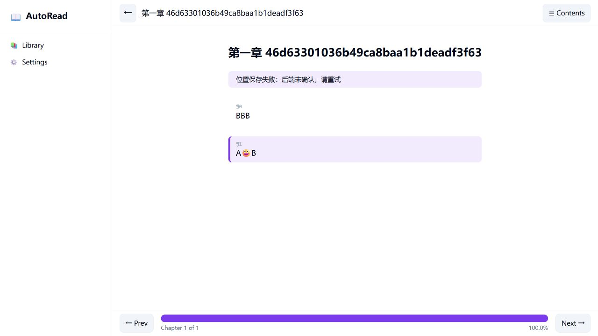

# READER-001 r3 独立复审：needs_fix（2026-10-06）

## 冻结基线

- reviewed_commit: `b3d93b766bca750e36cf94fd7d58959a851eae25`，复审开始时干净 detached；本地/远端 v0.6-dev 同提交。
- base_commit: `b94236c6e663a0592a02c4ed3af6f3ff2ffb5b51`（Phase 2 再激活基线）。实现修复链：4f7f044 → 96816d1 → d81c394 → 94b9134 → 60690ec。
- 唯一工作检出：`D:/autostack/auto-os/apps/018-book-reader`，由 git worktree list 核对；未另建 worktree。复审只新增证据、计划和导航，不修产品代码。
- auto CLI: `0.1.0+v0.4.2-2592-gee25d3b49-dirty`；exe SHA256 `CD3FEE2ED54228C16FD238463A6DA87F8AF11156DDB44594AD2670FDFC0D810E`。与上轮同一构建；源码 checkout 不冒充可执行文件的精确构建版本。
- canonical Spec: `docs/specs/reader/real-library.md`；最近修改 commit `8efc8ced9d055f0842453295e8f6a71099433788`；SHA256 `4563A852C7770A382CE534CD94667371E6972721FA01905D9F0B5BC46656ACC4`。
- 本次检查发生在后续用户请求的复审会话，不是 Phase 2 实现会话；从已提交代码、实际响应和页面行为重建结论。
- 用户前次明确授权“如果有问题重新激活计划001，并把问题和修复方案记录到计划001里（作为新的phase）”，此次继续要求检查。因此保留原 ID 和归档历史，移回活动目录并修订为 r4；该明确指令覆盖技能/仓库的归档终态默认约定。没有新增产品范围或降低验收。

## 本次实际验证

隔离目录为 `%TEMP%/reader001-review-20261006-independent`，未使用用户书库。先启动 `AUTO_READER_DATA=<隔离目录> auto run --server=vm`（Vue 前端 17824、VM 后端 17825）；后续 HTTP 与 UI 套件顺序执行。

| 检查 | 结果 |
|---|---|
| `auto test` | 3 passed / 0 failed，exit 0 |
| `auto tests/spec/t01_library_spec.as` 至 t06 对应脚本 | 34 + 28 + 26 + 14 + 23 + 42 = 167 PASS / 0 FAIL，新日志逐一检查 |
| `python tests/spec/t01_http_verify.py` / t02 / t04 | 39 + 21 + 12 = 72 PASS，exit 0 |
| `python tests/review/reader001_repro.py` | 8/8 PASS，exit 0；前轮 F-02/03/04/06 既有向量修复有效 |
| `playwright test real-book.spec.ts` / smoke.spec.ts | 7/7 + 10/10 PASS |
| `python tests/review/reader001_r3_repro.py` | 7 检查中 5 FAIL / 2 PASS，exit 1；失败为下列独立反例 |
| 浏览器真实交互与几何检查 | 等长变化假恢复、emoji 保存失败、恢复段未进视口均复现 |

Playwright 首次未启动：默认 headless_shell-1234 缺失，为环境问题。设置 `PW_CHROMIUM=C:/Users/zhaop/AppData/Local/ms-playwright/chromium-1243/chrome-win64/chrome.exe` 后重跑两套成功；`BOOK_URL=http://localhost:17824`。没有把环境失败计为产品回归。

新复现驱动在仓根运行：`AUTO_READER_DATA=<reader001-review-* 已存在目录> python tests/review/reader001_r3_repro.py`，默认后端 127.0.0.1:17825（REVIEW_BASE 可覆盖）。它只操作隔离库；错误索引检查每次及 finally 恢复原索引字节。保留等长变化 fixture 与第80段状态 fixture 供浏览器检查；故该驱动属于反例验证工件，不能当作原始规格已通过。

## Findings 与修复方向

| ID / 优先级 | AC / 任务 | 实测与原因 | 修复与验收 |
|---|---|---|---|
| F-08 / P1 | AC-02；T-07/08 → T-11 | 保存 AAA 的 `sig1:3:1` 后受管段落改成 BBB，旧锚点仍写入成功，页面显示“已恢复上次位置”。reading.at:38 的 para_hash 仅长度/行数，library.at:692 同样无内容信息；等长不同文必碰撞。 | 用内容锚点和来源版本校验；同长替换必须失效且不得标记恢复成功；旧 sig1 不可作为内容匹配证明。 |
| F-09 / P2 | AC-02/04；T-07 → T-12 | 合法 `"book_id" :` 被拒：`{"ok":false,"message":"missing book_id key"}`；chapter_number/paragraph_index/updated_at 数字字符串反被接受。library.at:756 起用精确文本计键，790 起将字段转字符串后判整数。 | 以真实 JSON 结构及字段类型校验，兼容合法空白/转义属性名并拒绝重复键、错误类型；负例保证上一有效状态字节不变。 |
| F-10 / P2 | AC-02/04；T-07/08 → T-11 | A😀B 在 Vue 中 sig1 长度=4（UTF-16），后端仅接受字节6或码点3，响应 `paragraph anchor mismatch`。真实点击同段显示“位置保存失败：后端未确认，请重试”。 | 统一 Vue/VM Unicode 内容锚点协议；包含 emoji、组合字符和中文的真实点击→保存→刷新恢复均成功，不增加第三种长度作内容校验。 |
| F-11 / P1 | AC-04；T-06 → T-13 | 索引 `{"version":1,"books":{}}` 被当空库，导入成功且原索引被重写。library.at:169–173 未校验 books 为数组。books:null、version:"1" 负例已拒绝并保留原件。 | 所有读/改入口共享结构校验，books 必须为列表，记录类型/必需字段验证；错误形状在任何写入前拒绝，索引及已有书库逐字保留。 |
| F-12 / P1 | AC-02；T-08/09 → T-14/15 | 100段书保存第80段后重新载入，标记存在但 top=6612.00048828125、bottom=6668.000492095947、viewportHeight=720、inViewport=false。既有 real-book.spec.ts:112 自己执行 scrollIntoViewIfNeeded，掩盖未滚动行为；T-08 已约定“目标段进入视口”。 | 产品实际恢复滚动，测试 reload 后直接检查交集、不替产品滚动；若框架能力缺失，登记具体前置计划并保持此项未验收。 |

浏览器反例书 ID：等长内容 `18dbaf73-0722-40b7-97cf-bdf8416ffd92`，视口 `18dbaf73-2f93-45b4-9413-f39fab693426`。临时输入路径 `%TEMP%/reader001-review-r3-cje0okel` 只用于本次定位；可持久重建的证据为仓内驱动和本报告摘录。

## 验收裁决

| AC | 结果 | 依据 |
|---|---|---|
| AC-01 | pass | 中文 TXT/Markdown、逐字内容与碰撞资产隔离成功路径重跑通过 |
| AC-02 | fail | F-08/F-10/F-12；持久化正常路径与显式章节行为的通过证据保留，未另声称本轮完成冷启动重启 |
| AC-03 | pass | 既有重复/force/受管副本反例与全量相关检查通过 |
| AC-04 | fail | F-09/F-11；其余错误/备份保护已通过，不代表所有 schema 通过 |
| AC-05 | pass | 移除/恢复/不删用户文件/备份与拒绝旧版本的重跑检查通过 |

全计划 **needs_fix**。10MiB 本轮 t04 仍为指令预算错误且库不变；这是错误保护通过，成功导入门槛保持未验收。本轮没有重新实测 VM 全轨 UI，也不能复用历史双轨声明为新锚点与滚动修复授予整体验收。框架差距登记不等于已约定目标通过。

重开 T-06/07/08/09/10、AC-02/04，保留 T-00/T-05 完成。T-01~04 的历史未勾选不重复计数；r4 新增 T-11~16，总计17任务、完成2任务。canonical Spec 与 live ledger 本轮不改；r3 发布文本中的内容锚点/schema/通过声明需在修复验证后通过计划 delta 更正。

## 冻结 r3 Spec delta（原文副本）

| delta_id | 操作 | 目标 | before/after rule | 理由 | 验收 |
|---|---|---|---|---|---|
| SD-02 | modify | docs/specs/reader/real-library.md §2/3/6 | ph1碰撞极低且force可保独立副本 → ph1仅候选，完整核对内容，资产隔离并定义旧库兼容 | 当前规则与F-02/F-03实测冲突 | AC-01/02/03 |
| SD-03 | modify | docs/specs/reader/real-library.md §3/4/5 | 宽松ID在场检查、长度签名恢复 → 状态schema校验、原文锚点校验、失配/保存失败及显式章节行为 | 不可把“写过文件/标了段”作为恢复成功 | AC-02/04 |
| SD-04 | modify | docs/specs/reader/real-library.md §2/3/4 | 写前.bak、io_error索引原状 → 验证过的备份/提交/中断恢复协议，损坏索引拒写，恢复日志写失败处理 | F-06说明现有承诺无真实保证 | AC-04/05 |
| SD-05 | modify | docs/specs/reader/real-library.md §6/8 | 8单测通过、长文空响应也算显式失败、双轨交付 → 精确工具/测试清单、可用默认入口、逐轨证据和未达门槛 | 不能通过记录债务/改断言降低验收 | AC-01~05 |

SD-02 与完整内容隔离证据一致；SD-03 的内容锚点/类型承诺未达到；SD-04 仍遗漏对象型 books 拒写；SD-05 虽说明10MiB差距，却不能据此关闭整体验收。SD-04 无 rename 的尽力写入边界保留，未声称断电原子性。修正候选见 r4 Phase 3，尚未发布为 current-state 规范。
