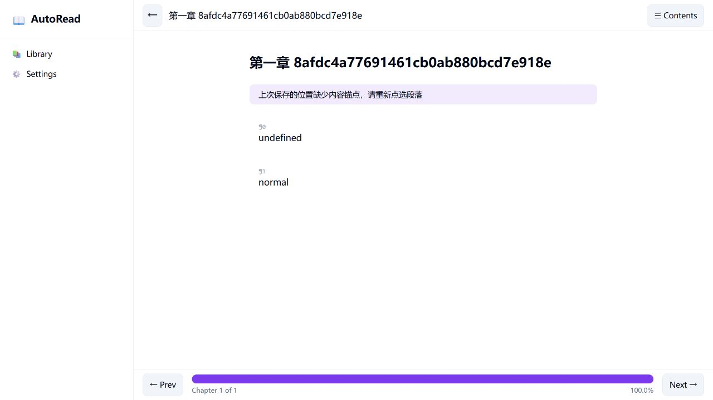

# READER-001 r4 提交后独立复审：needs_fix

日期：2026-10-06（Asia/Shanghai）。本次是用户在 Phase 3 修复提交后要求的普通独立最终验收，`review_scope: final`；复审在当前聊天进行，与 Phase 3 实现会话分离，没有创建其他 agent，也未伪造模型/session ID。

## 冻结基线与授权

- reviewed_commit: `8d414bb9fdc9e3663003df8aaccb64bbc67081d5`；Phase 3 实现 commit `05dd3209d06ab8adfe3db6237e44ab3caefb5f4e`；diff base `85f15717f393e57e89e931fccae255363d12d54b`。
- 实际检出 `D:/autostack/auto-os/apps/018-book-reader`，git worktree list 登记为子模块 gitdir 路径；入口 detached、实现干净，本地与远端 v0.6-dev 相同。复审写入仅证据/计划/导航，未修产品代码。
- 当前 auto CLI `0.1.0+v0.4.2-2785-ga6e108f60`，exe SHA256 `0B8F5D7BCCB41F4D0E02687D8DFF7A83F8E31E192A061C9E663918C7A60A71BF`。与 r4 实现侧自审的 2697/18E6EB58 构建不同，故本轮实际重跑，未沿用旧运行结论。
- canonical Spec `docs/specs/reader/real-library.md`，commit `bfc9edbd225c904c945880d94cb14083408e9eb8`，SHA256 `02126A1056A93D9835CAD44F8440CFBC51011E9E7C3BA5A8D3FF4A4E147535AD`；本轮不修改 canonical 或 live ledger。
- [原 r4 计划原字节冻结副本](reader001-r4-plan-frozen.md)，SHA256 `530f1ff16d8285390761668f6d636a19f1a4cb90cfef4447769dabe921694599`，包含 SD-06~10 原文、T-00~16及归档回执。副本保留原相对链接字面量；执行入口以重新激活的 r5 为准。
- 用户前次明确授权“如果有问题重新激活计划001，并把问题和修复方案记录到计划001里（作为新的phase）”，此次继续要求检查。因此同 ID 重新激活及 Phase 4 属既有授权，覆盖归档终态默认约定。目标/AC/仓库范围不增加，不执行产品修复。
- 复审收尾再次核对 HEAD、实现状态及上述 CLI/Spec hash，未发生基线漂移。记录文档时按 AGENTS §2.1切到同一检出的 v0.6-dev。

## 本轮实际执行与覆盖

隔离数据目录 `%TEMP%/reader001-review-r4-20261006-independent`，启动 `AUTO_READER_DATA=<隔离目录> auto run --server=vm`。Vue前端17824，VM后端17825；规格、HTTP、UI及独立索引注入顺序执行，未触碰用户书库。

| 门 | 实际结果与判据 |
|---|---|
| `auto test` | 5 passed / 0 failed，3文件，exit0 |
| `auto tests/spec/t01_library_spec.as` 至 t06 对应脚本 | 本次新写 `%TEMP%/tNN-spec.log`：34/38/26/14/23/51，共186 PASS、0 FAIL、每份done fails=0，6退出码均0。CLI stdout的0/false不是用例日志，先核对时间再读取脚本真正的日志路径 |
| 规格失败传播控制 | 临时脚本 `fn main(){ hash.file_sha256("__spec_failure__") }` 报 RuntimeError且exit1，与六套脚本的失败分支同原语 |
| 三套HTTP | t01=39 PASS；t02=26 PASS、另1 SKIP（该fixture无emoji）；t04=12 PASS，共77 PASS。t02计数重新读取本次日志确认；SKIP不当作F-10证据，emoji由r3驱动及UI实际覆盖 |
| `python tests/review/reader001_repro.py` | 8/8 PASS，exit0；但旧F-04两个输入缺新增顶层para_text，因框架绑定400而通过，不能据此单独证明已到达payload语义校验，后者采用t02/r3完整契约负例 |
| `python tests/review/reader001_r3_repro.py`（Phase 3 演进版） | 12/12 PASS，exit0；等长变文拒绝、新内容可重锚、emoji逐字持久化、合法JSON空白、错类型/重复键、books对象/null拒写通过 |
| `playwright test real-book.spec.ts smoke.spec.ts` | 9+10=19 PASS，exit0。PW_CHROMIUM使用既有chromium-1243/chrome-win64/chrome.exe，BOOK_URL=http://localhost:17824；没有下载软件 |
| 新 `python tests/review/reader001_r4_repro.py` | 8检查=2 PASS/6 FAIL，exit1；2个有效对照证明字面量undefined确实可保存且逐字存储，6个反例为读态3种错误和索引3个整数类型错误 |
| CUA实际浏览器观察 | 混排恢复目标完全在阅读视口之外；有效undefined状态被误判缺锚点；另书ID状态仍显示恢复成功 |

本轮既有19项UI与API覆盖Vue+VM后端。没有将VM全轨编译/启动等同于原生窗口的恢复行为；本轮未操作原生VM窗口，也未独立重跑冷启动，因此不冒称新双轨行为/重启验收。10MiB本轮仍显式预算错误且索引不变，这是错误保护成功，成功导入目标仍未验收。

新驱动默认 REVIEW_BASE=http://127.0.0.1:17825，要求已有reader001-review-*隔离目录；错误索引及状态逐次恢复，并在finally恢复原字节。生成合法undefined书和4000汉字长段+100短段书，供真实页面复现。它是针对已承诺不变量的独立控制，不新增产品需求。

## 发现与修复方向

| ID / 优先级 / 分类 | 影响 | 复现与原因 | 修复/永久用例 |
|---|---|---|---|
| F-12 / P1 / 原目标仍未闭合 | AC-02；T-14/15 | 长段4000汉字后接100个短段，保存¶50。产品显示恢复并自滚，但该段top=-2848.571533203125、bottom=-2792.5715293884277；pane=[56.000003814697266,664.0000038146973]，scrollTop=9652.5712890625、scrollHeight=10844；inPane=false/inViewport=false。reading.at:588按字符占比×滚动跨度推算，字符数不等于排版高度。均匀fixture通过不覆盖此路径。 | 使用真实布局/目标定位或可验证收敛的机制，使目标进入阅读pane；长短段、中文/ASCII、字号/换行、窗口宽度代表性组合直接断言pane交集，测试不得代为滚动。缺框架原语可列前置，但本目标不能关闭。 |
| F-13 / P2 / Phase 3新回归 | AC-02；T-11 | 原文单段字面量 `undefined`：POST ok=true、存储para_text="undefined"；页面重载却显示“上次保存的位置缺少内容锚点”，没有标记。reading.at:325将这个真实字符串改成空串，混淆缺失值与有效内容。 | 显式判断属性缺失/类型，或由后端提供结构化锚点有效性；不得保留一个合法正文字符串作为哨兵。真实点击→保存→重载测试包含undefined、null等合法正文，并保留旧无锚点负例。 |
| F-14 / P2 / T-12原读侧目标遗漏 | AC-02/04；T-12 | 外部状态为数字字符串chapter/pi、book_id="another-book"、仅book_id三种，GET都返回该对象。library.at:644只要求可解析且book_id非空，不验证schema/ID。错书ID状态若文本相同，浏览器依然显示“已恢复上次位置”且标记normal。 | 分离写入payload和存储态schema，共享类型/重复键等规则；读取验证完整字段和book_id与文件请求ID一致，坏态返回空/显式失效并保留原件。前端恢复也守卫身份；旧sig1兼容状态应明确可识别，不把所有错误形状当旧态。 |
| F-15 / P2 / T-13类型目标遗漏 | AC-04；T-13 | 合法索引仅分别把一条记录的chapter_count/size/import_version改成1.5，三次导入均ok并改写索引，1.5保留。jsonx.at:643 valid_record对这些字段只要求kind=num；746/753/760无整数性约束，未满足记录“整数类型精确”。 | 对整数元数据共享严格整数校验，覆盖size/chapter_count/import_version/created_at；非整数、小数/指数的允许性与既有整数协议明确一致，错误形状在写入前拒绝并保留索引及资产。有效整数、合法空库为正对照。 |

反例ID：undefined书 `18dbeaf3-88aa-42c6-87f3-6521e58d7884`，读态书 `18dbeaf4-4fa5-4bd1-ba3f-bc7817a39e52`，混排书 `18dbeaf7-289e-4ac0-89af-3e6475800220`；输入临时目录 `%TEMP%/reader001-review-r4-r4r3in86`。几何测量没有测试侧滚动。错书ID人工注入后已恢复隔离状态原字节。

## 闭合表与验收判据复核

这份交付已两次以上未通过提交后的独立复审。修复应以这里的不变量/实际oracle为准，不能再用“全套绿灯”代替遗漏路径。

| 范围 | 本次有效证据 | 当前闭合程度 |
|---|---|---|
| F-02/03/06 内容隔离、损坏副本、备份保护 | t01/05/06、r2向量重跑 | 代表性用例通过，保留已验证实现 |
| F-08/10 内容锚点/Unicode | r3向量、真实emoji保存恢复 | 已修原反例；F-13合法哨兵正文边界未闭合 |
| F-09 写侧JSON空白/类型/重复键 | t02 HTTP/r3驱动 | 原写侧反例通过；F-14读态入场仍有缺口 |
| F-11 books列表形状 | t06/r3驱动 | 对象/null等形状已拒；F-15记录整数类型未闭合 |
| F-12 用户恢复到原段 | 均匀UI fixture通过；独立混排inPane=false | 失败；oracle为恢复后目标与pane交集，不能替换为“controller调用了/段被标了” |
| 长文与双轨门 | 10MiB错误保护通过；原生窗口行为未实测 | 成功长文目标及双轨真实恢复仍未验收，不能归档为delivered pass |

AC-01=pass（中文正文/碰撞成功路径重跑）；AC-02=fail（F-12/13/14，重启未新增通过声明）；AC-03=pass（重复、force、中断代表性用例）；AC-04=fail（F-14/15，其他错误保护通过）；AC-05=pass（正常移除/恢复/保留用户源与备份路径重跑）。全计划 **needs_fix**，返回executing/r5。

## Spec delta 与下一步

冻结 SD-06~10原文见上述原计划副本，canonical hash同上。SD-06/07逐字内容与Unicode主体证据通过，但需修复合法undefined边界；SD-08写态和books形状主体通过，但读态/记录整数承诺不完整；SD-09估算及精度局限描述虽属实，其“目标进入视口”验收仍失败；SD-10没有授权10MiB降标或将VM启动代替窗口行为验收。现行知识与目标差异应经候选delta修正，而非本轮直接发布Spec/ledger。

按用户授权新增Phase 4，重开T-11~16/AC-02/04，保留T-00/T-05，完成2/23。T-00~16的稳定ID及历史原文保留，r5节5–8收敛为一份当前契约；新增T-17~22与有区分力的输入/判据，T-22由review负责。后续work提交修复后再final review；app/父仓文档推送、规范/台账更新、归档和检出收尾属于实际closeout，不是产品正确性延期到merge的入口。
